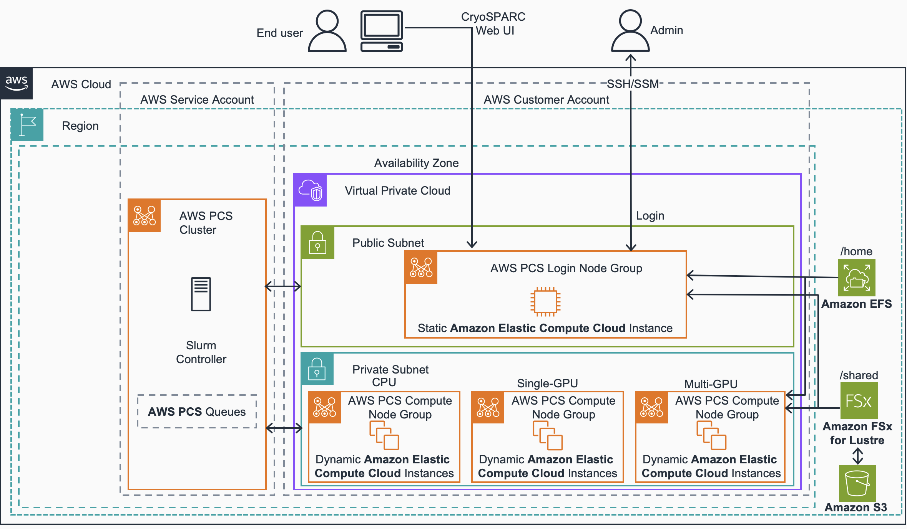
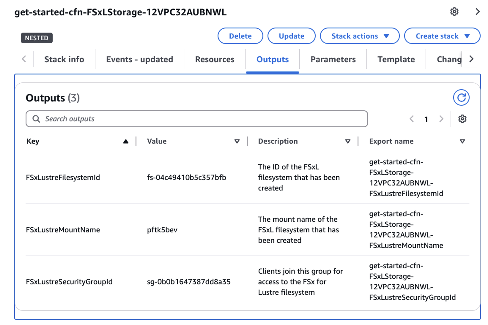
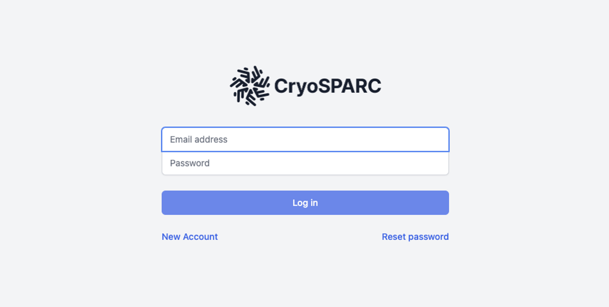

# Guidance for Cryo-EM on AWS Parallel Computing Service

## Table of Contents

- [Guidance for Cryo-EM on AWS Parallel Computing Service](#guidance-for-cryo-em-on-aws-parallel-computing-service)
  - [Table of Contents](#table-of-contents)
  - [Overview](#overview)
  - [Cost](#cost)
  - [Prerequisites](#prerequisites)
    - [Operating System](#operating-system)
    - [Supported Regions](#supported-regions)
    - [Data Transfer](#data-transfer)
  - [Deployment Steps](#deployment-steps)
  - [Running the Guidance](#running-the-guidance)
  - [Next Steps](#next-steps)
    - [Install ChimeraX for Visualization](#install-chimerax-for-visualization)
  - [Cleanup](#cleanup)
  - [FAQ, known issues, additional considerations, and limitations](#faq-known-issues-additional-considerations-and-limitations)
    - [AWS ParallelCluster](#aws-parallelcluster)
  - [Notices](#notices)
  - [License](#license)
  - [Authors](#authors)

## Overview

This guidance demonstrates how to deploy CryoSPARC for cryogenic electron microscopy (Cryo-EM) workloads on AWS Parallel Computing Service (PCS). Cryo-EM enables drug discovery researchers to determine three-dimensional molecular structures crucial for their research. This solution addresses the challenge of processing terabytes of microscopy data through scalable, heterogeneous computing combined with fast, cost-effective storage.

Below is the architecture model for this guidance.



## Cost

_You are responsible for the cost of the AWS services used while running this Guidance. As of September 2025, the cost for running this Guidance with the default settings in the US East (N. Virginia) is approximately $762.96 per sample. This estimate is based on processing 1 sample (1 TB of data). Cost calculations were derived using the times measured under realistic workload conditions for each instance type._

Below you can find a cost breakdown for this estimate based on the resources this guidance runs and assuming the aforementioned working periods (1 sample, 1 TB of data).

| AWS service                        | Dimensions                                | Cost [USD] |
| ---------------------------------- | ----------------------------------------- | ---------- |
| AWS Simple Storage Service (S3)    | 1 TB w/ Intelligent Tiering               | $ 23.72    |
| Amazon Elastic File Service (EFS)  | 100 GB Elastic Throughput                 | $ 30.00    |
| Amazon FSx for Lustre              | 1.2TB SSD - 250 MBps/TiB                  | $ 252.35   |
| AWS Parallel Compute Service (PCS) | Small Slurm Controller                    | $ 56.97    |
| Amazon Elastic Compute Cloud (EC2) | (CPU Group) 1 On-Demand c5a.8xlarge       | $ 0.16     |
| Amazon Elastic Compute Cloud (EC2) | (Single-GPU Group) 1 On-Demand g6.4xlarge | $ 28.35    |
| Amazon Elastic Compute Cloud (EC2) | (Multi-GPU Group) 1 On-Demand g6.48xlarge | $ 371.41   |

_We recommend creating a [Budget](https://docs.aws.amazon.com/cost-management/latest/userguide/budgets-managing-costs.html) through [AWS Cost Explorer](https://aws.amazon.com/aws-cost-management/aws-cost-explorer/) to help manage costs. Prices are subject to change. For full details, refer to the pricing webpage for each AWS service used in this Guidance._

## Prerequisites

In order to be able to run this guidance and to use CryoSparc you need to have the following:

- CryoSPARC license ([contact Structura Biotechnology to obtain](https://guide.cryosparc.com/licensing)).
- [AWS CLI](https://aws.amazon.com/cli/) installed and configured.
- See additional [prerequisites](https://docs.aws.amazon.com/pcs/latest/userguide/getting-started_prerequisites.html) from AWS PCS.
- An SSH client.

### Operating System

These deployment instructions are optimized to best work on a Mac or Linux environment. Deployment in Windows may require additional steps for setting up required libraries and CLI.

### Supported Regions

Only the following regions are supported for this guidance:

- United States (N. Virginia)
- United States (Ohio)
- United States (Oregon)

- Asia Pacific (Singapore)
- Asia Pacific (Sydney)
- Asia Pacific (Tokyo)

- Europe (Frankfurt)
- Europe (Ireland)
- Europe (London)
- Europe (Stockholm)

Deploying the guidance in other regions may lead to errors or inconsistent behavior.

### Data Transfer

Create a new S3 bucket for your input data.

The data transfer mechanism to move data from instruments into S3 depends on the connectivity in the lab environment and the volume of data to be transferred. We recommend [AWS DataSync](https://aws.amazon.com/datasync/), which automates secure data transfer from on-premises into the cloud with minimal development effort. [Storage Gateway File Gateway](https://aws.amazon.com/storagegateway/file/) is another viable option, especially if lab connectivity is limited or continued two-way access from on-premises to the transferred data sets is required. Both DataSync and Storage Gateway [can be bandwidth throttled](https://docs.aws.amazon.com/datasync/latest/userguide/working-with-task-executions.html) to protect non-HPC business-critical network constraints.

Alternatively, you can use the [AWS S3 CLI](https://docs.aws.amazon.com/cli/latest/reference/s3/) to transfer individual files, or use partner solution to get started quickly.

## Deployment Steps

1. **Clone the GitHub Repository**  
   Clone this repository. View this [README](deployment/aws-hpc-recipe/recipes/pcs/getting_started/README.md) for deploying a PCS cluster. To create a PCS cluster with the right shared storage for this example, you can use the PCS guidance recipes for a one-click deployment, which uses AWS CloudFormation to launch an entire cluster, quickly.

   ```bash
   git clone https://github.com/aws-samples/cryoem-on-aws-parallel-cluster.git
   cd deployment/aws-hpc-recipe/recipes/pcs/getting_started
   cat README.md
   ```

2. **Launch the PCS Cluster Using CloudFormation**
   - Navigate to the AWS Management Console → **CloudFormation**.
   - Choose **Create stack** → **With new resources (standard)**.
   - Upload the PCS template from the cloned repo.
   - Provide an **SSH key pair** if you want shell access to the login node.
   - Leave all other defaults unchanged and click **Create stack**.

   This creates:
   - Networking prerequisites
   - A Login Node group
   - One demo Compute Node group
   - An **Amazon EFS** file system mounted at `/home`
   - An **Amazon FSx for Lustre** file system mounted at `/shared`

   

3. **Update FSx for Lustre Throughput**  
   Increase throughput per unit of storage to support CryoSPARC installation:

   ```bash
   aws fsx update-file-system        --file-system-id <FSX_LUSTRE_ID>        --lustre-configuration PerUnitStorageThroughput=250
   ```

   This may take up to 20 minutes to complete.

4. **Retrieve Compute Node Group Information**  
   Run the following to get AMI ID, Instance Profile ARN, and Launch Template ID:

   ```bash
   aws pcs get-compute-node-group        --cluster-identifier <PCS_CLUSTER_NAME>        --compute-node-group-identifier compute-1
   ```

   Save the output values for use in the next step.

5. **Create Additional Compute Node Groups**  
   Run the following commands to create CPU, single-GPU, and multi-GPU node groups:

   ```bash
   aws pcs create-compute-node-group        --compute-node-group-name compute-cpu        --cluster-identifier <PCS_CLUSTER_NAME>        --region <REGION>        --subnet-ids <PRIVATE_SUBNET_ID>        --custom-launch-template id=<COMPUTE_LT_ID>,version='1'        --ami-id <AMI_ID>        --iam-instance-profile <INSTANCE_PROFILE_ARN>        --scaling-config minInstanceCount=0,maxInstanceCount=2        --instance-configs instanceType=c5a.8xlarge

   aws pcs create-compute-node-group        --compute-node-group-name compute-single-gpu        --cluster-identifier <PCS_CLUSTER_NAME>        --region <REGION>        --subnet-ids <PRIVATE_SUBNET_ID>        --custom-launch-template id=<COMPUTE_LT_ID>,version='1'        --ami-id <AMI_ID>        --iam-instance-profile <INSTANCE_PROFILE_ARN>        --scaling-config minInstanceCount=0,maxInstanceCount=2        --instance-configs instanceType=g6.4xlarge

   aws pcs create-compute-node-group        --compute-node-group-name compute-multi-gpu        --cluster-identifier <PCS_CLUSTER_NAME>        --region <REGION>        --subnet-ids <PRIVATE_SUBNET_ID>        --custom-launch-template id=<COMPUTE_LT_ID>,version='1'        --ami-id <AMI_ID>        --iam-instance-profile <INSTANCE_PROFILE_ARN>        --scaling-config minInstanceCount=0,maxInstanceCount=2        --instance-configs instanceType=g6.48xlarge
   ```

6. **Verify Node Group Creation**  
   Confirm that each node group is active:

   ```bash
   aws pcs get-compute-node-group        --region <REGION>        --cluster-identifier <PCS_CLUSTER_NAME>        --compute-node-group-identifier <NODE_GROUP_NAME>
   ```

   Wait until the status returns `ACTIVE`.

7. **Create Queues for Node Groups**  
   Map queues to node groups so CryoSPARC can submit jobs to the right hardware:

   ```bash
   aws pcs create-queue        --queue-name cpu-queue        --cluster-identifier <PCS_CLUSTER_NAME>        --compute-node-group-configurations computeNodeGroupId=<COMPUTE_CPU_NODE_GROUP_ID>

   aws pcs create-queue        --queue-name single-gpu-queue        --cluster-identifier <PCS_CLUSTER_NAME>        --compute-node-group-configurations computeNodeGroupId=<COMPUTE_SINGLE_GPU_NODE_GROUP_ID>

   aws pcs create-queue        --queue-name multi-gpu-queue        --cluster-identifier <PCS_CLUSTER_NAME>        --compute-node-group-configurations computeNodeGroupId=<COMPUTE_MULTI_GPU_NODE_GROUP_ID>
   ```

8. **Verify Queues**  
   Check that the queues are created and active:
   ```bash
   aws pcs get-queue         --region <REGION>         --cluster-identifier <PCS_CLUSTER_NAME>         --queue-identifier <PCS_QUEUE_NAME>
   ```

## Running the Guidance

1. **Log in to the PCS Login Node**
   - Open the **Amazon EC2 Console**.
   - Search for your Login Node instance using the tag:
     ```
     aws:pcs:compute-node-group-id=<LOGIN_COMPUTE_NODE_GROUP_ID>
     ```
   - Select the instance → **Connect** → **Session Manager** → **Connect**.
   - Switch to the `ec2-user`:
     ```bash
     sudo su - ec2-user
     ```

2. **Check Available Slurm Queues**  
   Run:

   ```bash
   sinfo
   ```

   You should see partitions for CPU, GPU, and multi-GPU nodes.

3. **Download and Run CryoSPARC Installation Script**

   ```bash
   wget https://raw.githubusercontent.com/aws-samples/cryoem-on-aws-parallel-cluster/refs/heads/main/parallel-computing-service/pcs-cryosparc-post-install.sh
   chmod +x pcs-cryosparc-post-install.sh
   sudo ./pcs-cryosparc-post-install.sh <LICENSE_ID> /shared/cryosparc /shared/cuda 11.8.0 11.8.0_520.61.05 /shared
   ```

   Installation can take up to an hour.

4. **Start the CryoSPARC Server**

   ```bash
   /shared/cryosparc/cryosparc_master/bin/cryosparcm start
   ```

5. **Create a CryoSPARC User**

   ```bash
   cryosparcm createuser        --email "<youremail@email.com>"        --password "<yourpassword>"        --username "<yourusername>"        --firstname "<yourfirstname>"        --lastname "<yourlastname>"
   ```

6. **Access the CryoSPARC UI**
   - Open an SSH tunnel from your local machine:
     ```bash
     ssh -i /path/to/key.pem -N -f -L localhost:45000:localhost:45000 ec2-user@<PUBLIC_IP>
     ```
   - In a browser, go to:  
     [http://localhost:45000](http://localhost:45000)
   - Log in with your CryoSPARC user credentials.
     
7. **Download and Extract a Test Dataset**

Download the [movies test set](https://guide.cryosparc.com/processing-data/get-started-with-cryosparc-introductory-tutorial) from the CryoSparc introductory tutorial.

```bash
mkdir /shared/data
cd /shared/data
/shared/cryosparc/cryosparc_master/bin/cryosparcm downloadtest
tar -xf empiar_10025_subset.tar
```

8. **Run a Test Job in CryoSPARC UI**
   - Create a new **Import Movies** job.
   - Select the `compute-cpu` lane (queue).
   - Submit the job.

   In the terminal, check the running job with:

   ```bash
   squeue
   ```

   or check allocated nodes with:

   ```bash
   sinfo
   ```

## Next Steps

#### Install ChimeraX for Visualization

Install ChimeraX on the login node and use Amazon DCV for remote desktop visualization. This can enable users to directly visualize CryoSPARC results without transferring data.

## Cleanup

To cleanup the provisioned resources follow these steps:

1. Delete PCS Queues

```bash
aws pcs delete-queue --cluster-identifier <pcs_cluster_name> --queue-identifier cpu-queue
aws pcs delete-queue --cluster-identifier <pcs_cluster_name> --queue-identifier single-gpu-queue
aws pcs delete-queue --cluster-identifier <pcs_cluster_name> --queue-identifier multi-gpu-queue
```

2. Delete Node Groups

```bash
aws pcs delete-compute-node-group --cluster-identifier <pcs_cluster_name> --compute-node-group-identifier compute-cpu
aws pcs delete-compute-node-group --cluster-identifier <pcs_cluster_name> --compute-node-group-identifier compute-single-gpu
aws pcs delete-compute-node-group --cluster-identifier <pcs_cluster_name> --compute-node-group-identifier compute-multi-gpu
```

3. Delete CloudFormation Stack

```bash
aws cloudformation delete-stack --stack-name <pcs_cloudformation_stack_name>
```

## FAQ, known issues, additional considerations, and limitations

### AWS ParallelCluster

AWS ParallelCluster offers an alternative deployment method for running CryoSPARC workloads. AWS ParallelCluster might be preferred when you need more granular control over your HPC infrastructure or require customized configurations that aren't available in PCS. It offers greater flexibility in cluster customization, including the ability to modify the underlying infrastructure, customize AMIs, and implement specific security configurations.

In such situations where AWS ParallelCluster may be preferred, an AWS guidance is available [here](README.md).

## Notices

_Customers are responsible for making their own independent assessment of the information in this Guidance. This Guidance: (a) is for informational purposes only, (b) represents AWS current product offerings and practices, which are subject to change without notice, and (c) does not create any commitments or assurances from AWS and its affiliates, suppliers or licensors. AWS products or services are provided “as is” without warranties, representations, or conditions of any kind, whether express or implied. AWS responsibilities and liabilities to its customers are controlled by AWS agreements, and this Guidance is not part of, nor does it modify, any agreement between AWS and its customers._

## License

This library is licensed under the MIT-0 License. See the LICENSE file.

## Authors

- Marissa Powers
- Juan Perin
- Rye Robinson
