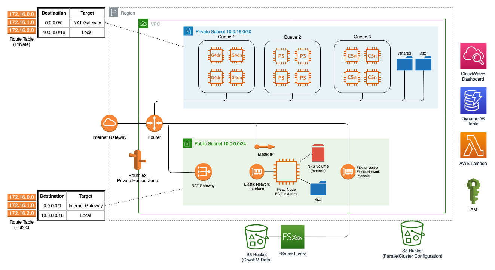

# Cryo-EM on AWS ParallelCluster

This GitHub repository contains resources to deploy the solution described in the [HPC Blog for CryoSparc on AWS ParallelCLuster|<blog-url>]



This solution includes the following resources:
* YAML configuration file for AWS ParallelCluster
* Post-install script to install CryoSPARC
* Policy file that allows automatic data export back to FSx

There are several prerequisites to fulfill before deploying this solution. You'll use the outputs of these prerequisites to fill in the values <between angle brackets> in the AWS ParallelCluster configuration file.

## Prerequisite: CryoSPARC license from Structura

First, you’ll need to [request a license from Structura|https://cryosparc.com/download]. It can take a day or two to obtain the license, so request it before you get started. 

Paste the license id as an input to the ParallelCluster configuration file.

## Prerequisites: Networking, Security, and Compute Availability

Most customers start with their default VPC, with public and private subnets balanced across multiple Availability Zones (AZs). However, ParallelCluster is a single-AZ service due to its latency requirements and cluster placement groups, so you should intentionally create your subnets to match the workload. For the compute notes, we created a single large private subnet a larger number of IP addresses. For the head node, we created a single public subnet with minimal IP addresses. 

HPC EC2 instances like the p4d family aren’t  available in every AZ, so be sure to create your subnets in a single AZ that fulfills all of the compute requirements for your HPC workload. To determine which AZ in your chosen Region has the compute family you require, use the AWS CLI describe-instance-type-offerings command. The easiest way to do this is to copy and paste the following command into CloudShell, which will quickly create and configure an environment where you can run AWS CLI commands.

```bash
aws ec2 describe-instance-type-offerings \
--location-type availability-zone \
--region <region> \
--filters Name=instance-type,Values=p4d.24xlarge \
--query "InstanceTypeOfferings[*].Location" \
--output text
```

Using the output showing which AZs have the compute instances you need, you can create your VPC and subnets. Populate the <REGION>, <SMALL-PUBLIC-SUBNET-ID>, and <LARGE-PRIVATE-SUBNET-ID> inputs in the configuration file.

You’ll also need to create an EC2 SSH key pair so that you can SSH into the head node once your cluster has been deployed, and populate the <EC2-KEY-PAIR-NAME> input in the configuration file.

## Prerequisite: Data Transfer 

Create a new S3 bucket for your input data. Replace the <S3-BUCKET> placeholders in the ParallelCluster configuration file with the name of your bucket.

The data transfer mechanism you choose to move data from instruments into S3 depends on the connectivity in your lab environment and the volume of data you intend to transfer. We recommended AWS DataSync, which easily automates secure data transfer from on-premises into the cloud with minimal development effort. Storage Gateway File Gateway is another viable option long-term, especially if lab connectivity is limited or you need continued two-way access from on-premises to the transferred data sets. Both DataSync and Storage Gateway can be bandwidth throttled to protect other business-critical network constraints. 
You can also use the S3 CLI directly or existing partner data transfer implementations on the Parallel Cluster head node to get started quickly without setting up new connections or data transfer configuration.

## Prerequisite: IAM Permissions

While ParallelCluster is capable of creating its own least-privilege roles and policies to function, many Enterprise customers limit their AWS account users’ access to IAM actions. ParallelCluster also supports using pre-created IAM resources, which we requested from Thermo Fisher’s Central IT Services team. The required permissions and roles are provided in the ParallelCluster documentation to help customers get started quickly. 

Newer persistent file systems can automatically export data back to S3, but scratch file systems don’t. However, customers can integrate a data export task into the ParallelCluster job scheduler so that every time a job completes, a data export is run transparently in the background.  However, this requires additional IAM Policy statements to be attached to the instance profile of the head node. The policy is in the file FSxLustreDataRepoTasksPolicy.yaml.

## Let's build!

### Upload artifacts to S3

Upload the parallel-cluster-cryosparc.yaml configuration file (with all of the <placeholders> filled in) and the parallel-cluster-post-install.sh script to your S3 bucket.

### Environment
We recommend using [AWS CloudShell|https://aws.amazon.com/cloudshell/] to quickly set up an environment that already has the credentials and command line tools you'll need to get started. [The AWS CloudShell Console|https://console.aws.amazon.com/cloudshell] already has credentials to your AWS account, the AWS CLI, and Python installed. If you're not using CloudShell, make sure you have these installed in your local environment before continuing.

### Install ParallelCluster
Follow the instructions to install AWS ParallelCluster into a virtual environment
https://docs.aws.amazon.com/parallelcluster/latest/ug/install-v3-virtual-environment.html

### Copy the ParallelCluster config file from S3
Copy config file from S3

```bash
aws s3api get-object --bucket cryosparc-parallel-cluster --key parallel-cluster-cryosparc.yaml parallel-cluster-cryosparc.yaml
```

If you were starting from scratch, you would run pcluster config to generate a config file. For this solution, we're providing that config file for you, so you can create the cluster immediately using the create-cluster command.

```bash
pcluster create-cluster --cluster-name cryosparc-cluster --cluster-configuration parallel-cluster-cryosparc.yaml 
```

Check the status of the cluster creation using the pcluster CLI or using the [AWS CloudFormation console|https://console.aws.amazon.com/cloudformation/]

```bash
pcluster describe-cluster --cluster-name cryosparc-cluster
```

<pcluster result screenshots>
<cryoSPARC screenshots>

## License

This library is licensed under the MIT-0 License. See the LICENSE file.

