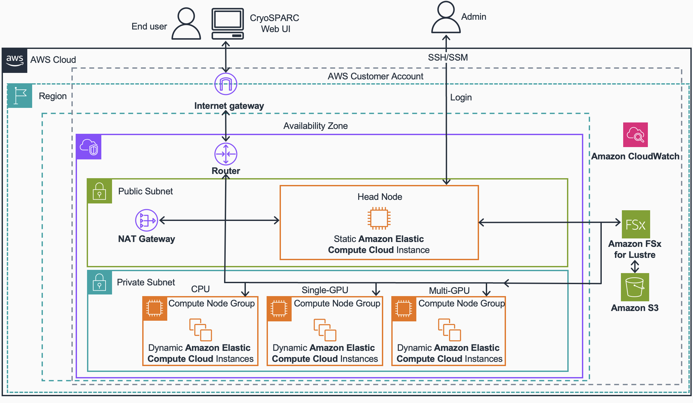

# Guidance for Cryo-EM on AWS Parallel Cluster and AWS Parallel Computing Service

## Introduction

This guide provides orientation for running Cryo-EM workflows on AWS. AWS offers two different parallel computing options: AWS ParallelCluster and AWS Parallel Computing Service (PCS). Each has strengths depending on workload complexity, ease of management, and scaling needs.

## Overview

### AWS ParallelCluster

An open-source cluster management tool that provisions and manages HPC clusters on AWS.

Offers fine-grained control over compute environments, schedulers (Slurm, etc.), networking and data management.

Best for reproducible environments, and tightly coupled workloads.

For detailed guidance on running Cryo-EM workloads using CryoSPARC with AWS ParallelCluster, refer to the Guidance [README](ParallelClusterREADME.md).

Below is the architecture for the AWS Parallel Cluster Guidance.

### AWS Parallel Computing Service (PCS)

A managed service for running parallel workloads without needing to manage the underlying infrastructure.

Ideal for on-demand scaling.

Lower operational burden, more “serverless” style.

For detailed guidance on running Cryo-EM workloads using CryoSPARC with AWS ParallelCluster, refer to the Guidance [README](PCSREADME.md).

Below is the architecture for the AWS PCS Guidance.

