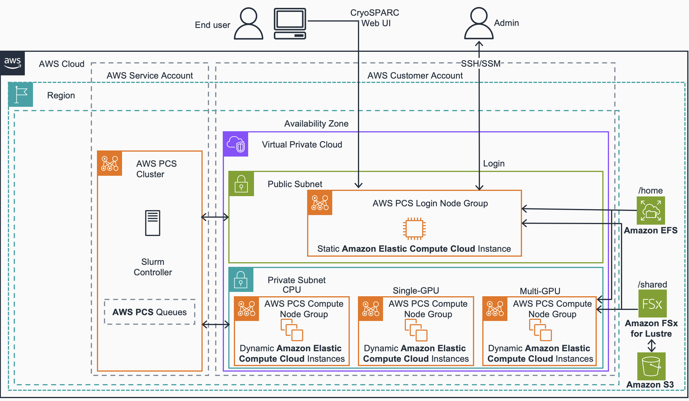

# Guidance for Cryo-EM on AWS ParallelCluster and AWS Parallel Computing Service

- [Guidance for Cryo-EM on AWS ParallelCluster and AWS Parallel Computing Service](#guidance-for-cryo-em-on-aws-parallelcluster-and-aws-parallel-computing-service)
  - [Overview](#overview)
  - [Cost](#cost)
  - [Prerequisites](#prerequisites)
    - [Environment](#environment)
    - [Supported Regions](#supported-regions)
    - [Data Transfer](#data-transfer)
    - [CryoSPARC License](#cryosparc-license)
    - [Networking and Compute Availability](#networking-and-compute-availability)
    - [IAM Permissions](#iam-permissions)
    - [Data Export Policy (Optional)](#data-export-policy-optional)
  - [Deployment Steps](#deployment-steps)
  - [Running the Guidance](#running-the-guidance)
  - [Cleanup](#cleanup)
  - [FAQ, known issues, additional considerations, and limitations](#faq-known-issues-additional-considerations-and-limitations)
    - [AWS Parallel Computing Service (PCS)](#aws-parallel-computing-service-pcs)
  - [Notices](#notices)
  - [License](#license)
  - [Authors](#authors)

## Overview

This guidance demonstrates how to deploy CryoSPARC for cryogenic electron microscopy (Cryo-EM) workloads on AWS ParallelCluster. Cryo-EM enables drug discovery researchers to determine three-dimensional molecular structures crucial for their research. This solution addresses the challenge of processing terabytes of microscopy data through scalable, heterogeneous computing combined with fast, cost-effective storage.

Below is the architecture model for this guidance.


## Cost

_You are responsible for the cost of the AWS services used while running this Guidance. As of September 2025, the cost for running this Guidance with the default settings in the US East (N. Virginia) is approximately $737.22 per sample. This estimate is based on processing 1 sample (1 TB of data). Cost calculations were derived using the times measured under realistic workload conditions for each instance type._

Below you can find a cost breakdown for this estimate based on the resources this guidance runs and assuming the aforementioned working periods (1 sample, 1 TB of data).

| AWS service                        | Dimensions                  | Cost [USD] |
| ---------------------------------- | --------------------------- | ---------- |
| AWS Simple Storage Service (S3)    | 1 TB w/ Intelligent Tiering | $ 23.72    |
| Amazon Elastic File Service (EFS)  | 100 GB Elastic Throughput   | $ 30.00    |
| Amazon FSx for Lustre              | 1.2TB SSD - 250 MBps/TiB    | $ 252.35   |
| AWS Parallel Compute Service (PCS) | Small Slurm Controller      | $ 31.23    |
| Amazon Elastic Compute Cloud (EC2) | 1 On-Demand c5a.8xlarge     | $ 0.16     |
| Amazon Elastic Compute Cloud (EC2) | 1 On-Demand g6.4xlarge      | $ 28.35    |
| Amazon Elastic Compute Cloud (EC2) | 1 On-Demand g6.48xlarge     | $ 371.41   |

_We recommend creating a [Budget](https://docs.aws.amazon.com/cost-management/latest/userguide/budgets-managing-costs.html) through [AWS Cost Explorer](https://aws.amazon.com/aws-cost-management/aws-cost-explorer/) to help manage costs. Prices are subject to change. For full details, refer to the pricing webpage for each AWS service used in this Guidance._

## Prerequisites

In order to be able to run this guidance and to use CryoSparc you need to have the following:

- CryoSPARC license ([contact Structura Biotechnology to obtain](https://guide.cryosparc.com/licensing)).
- [AWS CLI](https://aws.amazon.com/cli/) installed and configured.
- See additional [prerequisites](https://docs.aws.amazon.com/pcs/latest/userguide/getting-started_prerequisites.html) from AWS PCS.
- An SSH client.

### Environment

We recommend using [AWS CloudShell](https://aws.amazon.com/cloudshell/) to quickly set up an environment that already has the credentials and command line tools you'll need to get started. [The AWS CloudShell Console](https://console.aws.amazon.com/cloudshell) already has credentials to your AWS account, the AWS CLI, and Python installed. If you're not using CloudShell, make sure you have these installed in your local environment before continuing.

### Supported Regions
Only the following regions are supported for this guidance:

- United States (N. Virginia)
- United States (Ohio)
- United States (Oregon)

- Asia Pacific (Singapore)
- Asia Pacific (Sydney)
- Asia Pacific (Tokyo)

- Europe (Frankfurt)
- Europe (Ireland)
- Europe (London)
- Europe (Stockholm)

Deploying the guidance in other regions may lead to errors or inconsistent behavior.

### Data Transfer

Create a new S3 bucket for your input data.

The data transfer mechanism to move data from instruments into S3 depends on the connectivity in the lab environment and the volume of data to be transferred. We recommend [AWS DataSync](https://aws.amazon.com/datasync/), which automates secure data transfer from on-premises into the cloud with minimal development effort. [Storage Gateway File Gateway](https://aws.amazon.com/storagegateway/file/) is another viable option, especially if lab connectivity is limited or continued two-way access from on-premises to the transferred data sets is required. Both DataSync and Storage Gateway [can be bandwidth throttled](https://docs.aws.amazon.com/datasync/latest/userguide/working-with-task-executions.html) to protect non-HPC business-critical network constraints.

Alternatively, you can use the [AWS S3 CLI](https://docs.aws.amazon.com/cli/latest/reference/s3/) to transfer individual files, or use partner solution to get started quickly.

### CryoSPARC License
First, you'll need to request a license from Structura. It can take a day or two to obtain the license, so request it before you get started. You'll use this license ID to replace the <CRYOSPARC-LICENSE> placeholder in the configuration file.

### Networking and Compute Availability
A typical use of a default VPC has public and private subnets balanced across multiple Availability Zones (AZs). However, HPC clusters (like ParallelCluster) usually prefer a single-AZ so they can keep communication latency low and use Cluster Placement Groups. For the compute nodes, you can create a large private subnet with a relatively large number of IP addresses. Then, you can create a public subnet with minimal IP addresses, since it will only contain the head node.

HPC EC2 instances like the [P4d family](https://aws.amazon.com/ec2/instance-types/p4/) aren’t available in every AZ. That means we need to determine which AZ in a given Region has all the compute families we need. We can do that with the [AWS CLI](https://aws.amazon.com/cli/) [describe-instance-type-offerings](https://docs.aws.amazon.com/cli/latest/reference/ec2/describe-instance-type-offerings.html) command. The easiest way to do this is to use [CloudShell](https://aws.amazon.com/cloudshell/), which provides a shell environment ready to issue AWS CLI commands in a few minutes. If you want a more permanent development environment for ParallelCluster CLI calls, you can use [Cloud9](https://aws.amazon.com/cloud9) which persists an IDE environment, including a Terminal in which you can run CLI commands. After you've provisioned the environment is provisioned, copy and paste the text into the shell.

```bash
aws ec2 describe-instance-type-offerings \
--location-type availability-zone \
--region <region> \
--filters Name=instance-type,Values=p4d.24xlarge \
--query "InstanceTypeOfferings[*].Location" \
--output text
```

Using the output showing which AZs have the compute instances you need, you can create your VPC and subnets. Populate the `<REGION>`, `<SMALL-PUBLIC-SUBNET-ID>`, and `<LARGE-PRIVATE-SUBNET-ID>` inputs in the configuration file.

You’ll also need to [create an EC2 SSH key pair](https://docs.aws.amazon.com/AWSEC2/latest/UserGuide/create-key-pairs.html) so that you can SSH into the head node once your cluster has been deployed, and populate the `<EC2-KEY-PAIR-NAME>` input in the configuration file.

### IAM Permissions
While ParallelCluster creates its own least-privilege roles and policies by default, many Enterprises limit their AWS account users’ access to IAM actions. ParallelCluster also supports using or adding pre-created IAM resources, which you can request to be pre-created for you by your IT services team. The required permissions and roles are [provided in the ParallelCluster documentation](https://docs.aws.amazon.com/parallelcluster/latest/ug/iam-roles-in-parallelcluster-v3.html).

Use [parallel-cluster-cryosparc.yaml](./deployment/parallel-cluster-cryosparc.yaml) - if your account allows ParallelCluster to create new IAM Roles and Policies.

Use [parallel-cluster-cryosparc-custom-roles.yaml](./deployment/parallel-cluster-cryosparc-custom-roles.yaml) - if your account restricts creation of new IAM resources, which has additional IAM fields, to help you get started quickly.

If using custom roles, refer to the ParallelCluster IAM documentation for required permissions.

Note: In ParallelCluster 3.4+, the config file accepts EITHER S3Access OR InstanceRole parameters, but not both. Ensure your roles have S3 access in addition to the policies outlined in the documentation.

### Data Export Policy (Optional)

If you want to automatically export data back to Amazon S3 after job completion, you'll need to attach the [FSxLustreDataRepoTasksPolicy.yaml](./deployment/FSxLustreDataRepoTasksPolicy.yaml) to the head node's instance profile.

## Deployment Steps

1. **Clone the repository containing the ParallelCluster configuration files**
   ```bash
   git clone https://github.com/aws-samples/cryoem-on-aws-parallel-cluster.git
   ```

2. **Navigate to the repository folder**
   ```bash
   cd cryoem-on-aws-parallel-cluster
   ```

3. **Identify available Availability Zones for your required instance types**
   
   Use AWS CloudShell or Cloud9 to run the following command (replace `<region>` with your target AWS region, e.g., `us-east-1`):
   ```bash
   aws ec2 describe-instance-type-offerings \
   --location-type availability-zone \
   --region <region> \
   --filters Name=instance-type,Values=p4d.24xlarge \
   --query "InstanceTypeOfferings[*].Location" \
   --output text
   ```
   This command identifies which Availability Zones support P4d instances. Note the output for use in the next step.

4. **Create VPC and subnets in the identified Availability Zone**
   
   Create a VPC with:
   - One small public subnet (for the head node)
   - One large private subnet (for compute nodes with a relatively large number of IP addresses)
   
   Ensure your public subnet is configured to automatically assign IPv4 addresses and has DNS enabled.
   
   Capture the subnet IDs using:
   ```bash
   aws ec2 describe-subnets --filters "Name=vpc-id,Values=<your-vpc-id>" --query "Subnets[*].[SubnetId,CidrBlock,AvailabilityZone]" --output table
   ```

5. **Create an EC2 SSH key pair**
   ```bash
   aws ec2 create-key-pair --key-name cryosparc-cluster-key --query 'KeyMaterial' --output text > cryosparc-cluster-key.pem
   chmod 400 cryosparc-cluster-key.pem
   ```
   This creates a key pair and saves the private key locally. The key name will be used in the configuration file.

6. **Create an S3 bucket for ParallelCluster artifacts**
   ```bash
   aws s3 mb s3://cryosparc-parallel-cluster-<your-account-id> --region <region>
   ```
   Replace `<your-account-id>` with your AWS account ID and `<region>` with your target region.

7. **Edit the ParallelCluster configuration file**
   
   Open either `parallel-cluster-cryosparc.yaml` or `parallel-cluster-cryosparc-custom-roles.yaml` and replace the following placeholders:
   - `<CRYOSPARC-LICENSE>` - Your CryoSPARC license ID from Structura
   - `<REGION>` - Your AWS region (e.g., `us-east-1`)
   - `<SMALL-PUBLIC-SUBNET-ID>` - The subnet ID for your public subnet
   - `<LARGE-PRIVATE-SUBNET-ID>` - The subnet ID for your private subnet
   - `<EC2-KEY-PAIR-NAME>` - The name of your SSH key pair (e.g., `cryosparc-cluster-key`)

8. **Upload the configuration file and post-install script to S3**
   ```bash
   aws s3 cp parallel-cluster-cryosparc.yaml s3://cryosparc-parallel-cluster-<your-account-id>/
   aws s3 cp parallel-cluster-post-install.sh s3://cryosparc-parallel-cluster-<your-account-id>/
   ```

9. **Install AWS ParallelCluster in a Python virtual environment**
   ```bash
   python3 -m venv pcluster-venv
   source pcluster-venv/bin/activate
   pip install --upgrade pip
   pip install aws-parallelcluster
   ```
   
10. **Install Node Version Manager and LTS Node.JS Version**
    ```bash
    curl -o- https://raw.githubusercontent.com/nvm-sh/nvm/v0.38.0/install.sh | bash
    chmod ug+x ~/.nvm/nvm.sh
    source ~/.nvm/nvm.sh
    nvm install --lts
    node --version
    ```

11. **Verify ParallelCluster installation**
    ```bash
    pcluster version
    ```
    This confirms ParallelCluster CLI is properly installed.

12. **Copy the ParallelCluster configuration file from S3**
    ```bash
    aws s3api get-object --bucket cryosparc-parallel-cluster-<your-account-id> --key parallel-cluster-cryosparc.yaml parallel-cluster-cryosparc.yaml
    ```

13. **Create the ParallelCluster**
    ```bash
    pcluster create-cluster --cluster-name cryosparc-cluster --cluster-configuration parallel-cluster-cryosparc.yaml
    ```
    This command initiates the cluster creation process using AWS CloudFormation.

14. **Monitor cluster creation status**
    ```bash
    pcluster describe-cluster --cluster-name cryosparc-cluster
    ```
    Alternatively, monitor progress in the [AWS CloudFormation console](https://console.aws.amazon.com/cloudformation/).
    
    The cluster is ready when the status shows `CREATE_COMPLETE`.

15. **Capture the head node instance ID (once cluster is created)**
    ```bash
    aws cloudformation describe-stack-resources --stack-name cryosparc-cluster --query "StackResources[?LogicalResourceId=='HeadNode'].PhysicalResourceId" --output text
    ```

16. **Capture the head node public IP address**
    ```bash
    pcluster describe-cluster --cluster-name cryosparc-cluster --query "headNode.publicIpAddress" --output text
    ```

17. **Install CryoSparc on Head Node**
    
    View [parallel-cluster-post-install.sh](source/parallel-cluster-post-install.sh) before execution. 
    ```bash
    chmod +x source/parallel-cluster-post-install.sh
    ./source/parallel-cluster-post-install.sh
    ```

**Troubleshooting:** If the stack rolls back due to a failure:
- Verify your public subnet automatically assigns IPv4 addresses and has DNS enabled
- Re-create the cluster with the `--rollback-on-failure false` flag to preserve resources for troubleshooting:
  ```bash
  pcluster create-cluster --cluster-name cryosparc-cluster --cluster-configuration parallel-cluster-cryosparc.yaml --rollback-on-failure false
  ```
- Check the HeadNode system logs in the EC2 console: Select the instance → Actions → Monitor and troubleshoot → Get system log

## Running the Guidance
Once your cluster has been deployed and provisioned, you are ready to continue using AWS ParallelCluster to run CryoSPARC jobs as described in their [documentation](https://guide.cryosparc.com/setup-configuration-and-management/cryosparc-on-aws).

## Cleanup

To clean up your cluster, use ParallelCluster's delete-cluster command to de-provision the underlying resources in your cluster.

```bash
pcluster delete-cluster --cluster-name cryosparc-cluster
```

Once the cluster has been deleted, you can delete the files you uploaded to S3 and the S3 bucket itself, along with the data transfer solution you chose in the prerequisite sections.

## FAQ, known issues, additional considerations, and limitations

### AWS Parallel Computing Service (PCS)

AWS Parallel Computing Service (PCS) offers an alternative deployment method for running CryoSPARC workloads. PCS might be preferred when you want a fully managed experience with less operational overhead, faster setup, and easier scaling compared to managing infrastructure manually. It abstracts much of the complexity of HPC cluster management while still allowing you to run large-scale distributed workloads.

In such situations where AWS PCS may be preferred, an AWS guidance is available [here](PCSREADME.md).

You can find the post-install sample code in `source/pcs-cryosparc-post-install.sh` as referenced in the Scalable Cryo-EM on AWS Parallel Computing Service (PCS) guidance for installation on the login node. The full architecture of the guidance is as follows and can be found on the guidance.

## Notices

_Customers are responsible for making their own independent assessment of the information in this Guidance. This Guidance: (a) is for informational purposes only, (b) represents AWS current product offerings and practices, which are subject to change without notice, and (c) does not create any commitments or assurances from AWS and its affiliates, suppliers or licensors. AWS products or services are provided “as is” without warranties, representations, or conditions of any kind, whether express or implied. AWS responsibilities and liabilities to its customers are controlled by AWS agreements, and this Guidance is not part of, nor does it modify, any agreement between AWS and its customers._



## License

This library is licensed under the MIT-0 License. See the LICENSE file.

## Authors

- Natalie White
- Brian Skjerven